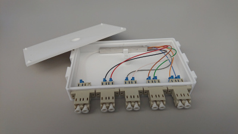
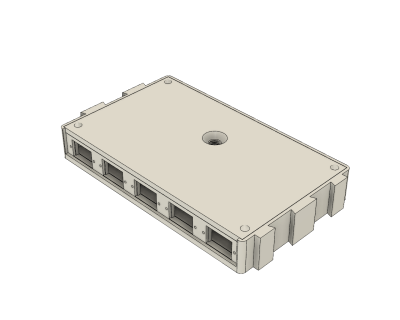
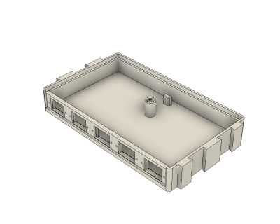
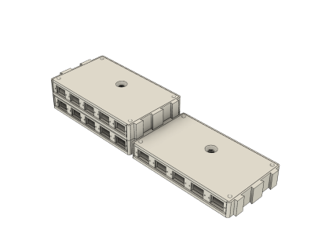
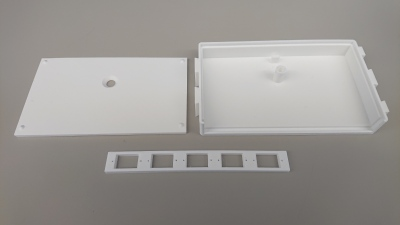
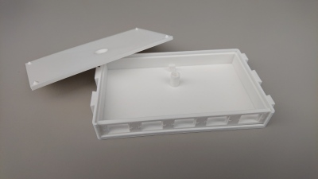
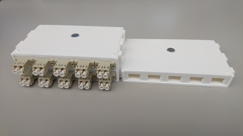

# 3D Fiber Optic Project Enclosure (04/2019)

<table>
<tr>
<td></td>
<td></td>
</tr>
<tr>
<td></td>
<td></td>
</tr>
<tr>
<td></td>
<td></td>
</tr>
<tr>
<td></td>
</tr>
</table>

A 3D printable fiber optic project enclosure. The front panel has cutouts for five LC duplex couplers, which can be mounted by their snap latches or with M2 screws. The enclosure mates horizontally with dovetails, and stacks vertically. The lid is secured with a single M5x8 flat head screw. The enclosure depth is an adjustable parameter. Pictured is the enclosure used to house a 1x8 PLC splitter.

**Design**: [Splitter Enclosure v26.f3d](Splitter%20Enclosure%20v26.f3d) (Fusion 360 Archive)

**Design**: https://a360.co/2uZwJvp (A360)

**STLs**:

  * [Base.stl](stls/Base.stl)
  * [Panel.stl](stls/Panel.stl)
  * [Lid.stl](stls/Lid.stl)

**Recommended Print Settings:** 0.20mm layer height, 20% infill

**Thingiverse:** https://www.thingiverse.com/thing:3597057

**License**: 
